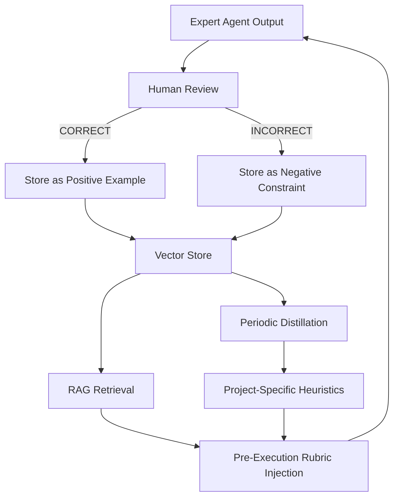
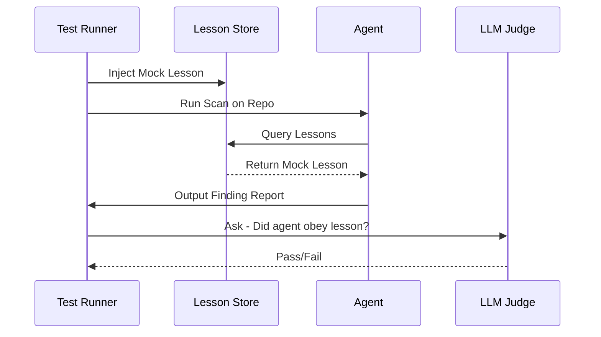

# Autochitect: Architecture & Technical Design

Autochitect is designed to pull private Git repositories, map their structural topology efficiently, and autonomously critique their architecture against best practices.

**Core Paradigm: Build heavily on Open-Source Agent Frameworks (LangChain).**
Building agent orchestration from scratch is complex. We rely on **LangChain (and its LangGraph extension)** to manage the state machine. The architectural assessment workflow is inherently a Directed Acyclic Graph (DAG) that conditionally moves through Context -> Container -> Component -> Infrastructure analysis.

---

## 1. The SaaS Control Plane (Orchestrator)

**Role:** The web dashboard, job scheduler, and centralized repository for analysis reports and **Dynamic Configurations**.

**Tech Stack:** 
*   **Framework:** Next.js (App Router) + TypeScript.
*   **Expert Registry:** A central store that maps languages/frameworks to **Expert Blueprints** (Prompts, AST Queries, and specialized Tooling configurations).
*   **Model Router:** A cost-optimizing layer that selects the most efficient model (e.g., Gemini Flash for AST mapping, Sonnet for architectural critique) based on task complexity. This ensures high ROI by commoditizing LLM compute.

#### 1.1 SaaS Registry Schema (Technical Specification)
*(See previous section for schema details)*

#### 1.2 Expert Registry Enrichment (The Intelligence Flywheel)
The Registry is enriched through three primary channels, ensuring it stays ahead of generic LLMs:

1.  **Direct Knowledge Injection (Human Architects):**
    - Senior architects use a **"Expert Studio" UI** to define baseline "Blueprints" for a framework. They provide the most critical AST queries and the high-level "Soul" of the framework's architecture.
2.  **Autonomous Pattern Mining (The Distillation Loop):**
    - As Autochitect scans "Golden" open-source repositories (e.g., highly-starred ABP or Spring Boot samples), it uses its **Discovery Sequence** to identify recurring structural patterns.
    - These patterns are processed by the **Distiller Agent**, which proposes new Tree-sitter queries and heuristic fragments for the Registry.
3.  **LLM-Assisted "Tool Smithing":**
    - We feed the framework's documentation (e.g., ABP.io docs) into a specialized **Smithing Agent**. 
    - This agent translates documentation directives (e.g., *"Modules must inherit from AbpModule"*) into deterministic **Registry Shards** (Regex triggers + AST queries).
4.  **Feedback-Driven Refinement:**
    - Every human `CORRECT` or `INCORRECT` verdict on a report is analyzed. If multiple users mark a specific Registry-driven finding as `INCORRECT`, the Registry's heuristic for that framework is automatically flagged for an architect's review or autonomous tuning.

**Key Design Decisions:**
*   **Token Security:** Raw GitHub OAuth tokens are never placed on the job queue. Instead, jobs use temporary asymmetric key exchange (or short-lived installation tokens) dispatched securely via HTTPS webhooks to the Runner.
*   **Simple Polling:** The Next.js UI avoids fragile WebSocket connections by using standard **HTTP Polling (via SWR/React Query)** every 3 seconds to fetch the latest job status from the database.

---

## 2. The Custom Execution Runner (Compute Plane)

**Role:** The isolated computation node that pulls private code, parses syntax trees, and executes the agentic analysis workflows.

**Tech Stack:**
*   **Infrastructure:** "Bring Your Own Runner" (BYOR) model. Runs locally on the user's/founder's own Mac/PC. This drives initial compute costs for massive code parsing to precisely zero while scaling infinitely.
*   **Daemon:** A lightweight Node.js/Go worker OR the **npm-distributable CLI** (`npx autochitect`).
*   **Isolation Engine:** Docker Engine (Host machine) or host-native (for local directory audits).

**Key Design Decisions:**
*   **Ephemeral Isolation:** The worker daemon executes a unique Docker container (`docker run --rm`) for every job. Once the API returns the result, the container—and the client's cloned codebase—is instantly wiped from the disk.

---

## 3. The Architecture Orchestration Agent (Inside Runner)

**Role:** The LangChain state machine running inside the isolated Docker container that controls the actual code analysis.

**Tech Stack:** 
*   **Framework:** LangChain JS (TypeScript) + **Multi-Provider LLM Factory** (Supporting Gemini, Claude, OpenAI, Vertex AI, and Ollama).
*   **Dynamic Expert Routing:** Unlike traditional static switch-cases, the router queries the SaaS Registry to spawn agents based on detected tech vectors.
*   **Target Ingestion:** Supports both **Secure Git Cloning** and **Native Local Directory Analysis** (automatic heuristic detection).
*   **Static Parsing:** `tree-sitter-cli` using queries downloaded dynamically from the Registry.

**Execution Flow:**
1.  **Code Ingestion:** Container clones the target repository OR skips cloning if a local directory is detected.
2.  **Phase A: Language Detection & Parsing:** Agent scans the file tree and maps extensions to `tree-sitter` grammar binaries to generate an Abstract Syntax Tree (AST).
3.  **Phase B: Querying the Topology (LLM Autopilot):** Instead of dumping 50,000 files into an LLM context window, we give the LangChain Orchestrator an "Autopilot Mode".
    *   **Infrastructure Signals:** The agent uses `find_infrastructure_signals` to locate Docker, IaC, and manifests, quickly inferring L1/L2 boundaries.
    *   The LLM dynamically writes its own S-expression queries (`run_tree_sitter_query(query)`).
    *   It queries for boundaries like module declarations, `import` dependencies, HTTP integrations, and class structures.
4.  **Phase C: Symbol Graph Compression:** The raw AST is stripped of comments, loops, and logic, reducing it into a minified "Symbol Graph" JSON topology map.
5.  **Phase D: Expert Execution & Chain-of-Verification (CoVe):**
    *   The runner requests a prompt tailored to the detected framework from the **SaaS Prompt Registry**.
    *   **CoVe Sub-Loop:** The Expert Agent drafts a finding, then performs a **self-correction pass**, specifically seeking evidence that contradicts its own hypothesis (e.g., global filters, parent class logic).
    *   **Model Routing:** Cheap models (Gemini-Flash) are used for mapping; premium models (Claude 3.5 Sonnet) are used for this final high-precision architectural critique.
6.  **Phase E: Evidence Grounding & The Reflection Loop:**
    *   **Evidence Grounding:** Every finding MUST pass a deterministic check: `file_exists(path)` and `code_exists(snippet)`. Hallucinated citations trigger an automatic re-prompt.
    *   **Visual C4 Reporting:** The agent is required to synthesize findings into live **Mermaid.js 11.x C4 diagrams** (using `C4Context`, `C4Container`, etc.). Diagrams are optimized for **Auto-layout** (no trailing commas, quoted labels) and embedded directly in the report for immediate structural visualization.
    *   The validated report is submitted to the **Challenger** node for final cross-check against the **Lesson Store**.
7.  **Artifact Generation:** Final reports are pushed to the SaaS database via webhook.

---

## 5. Learning & Feedback Loop (The Knowledge Engine)

To move beyond static analysis, Autochitect implements a continuous reinforcement loop based on human-in-the-loop validation. We adopt a **RAG-First Strategy**, evolving toward a hybrid model as the dataset matures.

### 5.3 The Feedback Flywheel



### 5.4 Continuous Improvement Mechanisms

To ensure the agent actually improves over time rather than just accumulating a list of scattered notes, Autochitect employs three specific mechanisms:

1.  **Anti-Regression (The Challenger Node):** 
    The `Challenger` node (Section 4.1) is upgraded to query the Lesson Store *before* validating an expert's draft. If the expert proposes a finding that matches a known `FALSE_POSITIVE` lesson, the Challenger rejects the draft immediately, forcing the Expert to find a different, valid approach.

2.  **Semantic Lesson Retrieval:**
    *   Instead of exact keyword matching, we use **LLM-based semantic relevance** to select lessons. 
    *   The agent summarizes its initial discovery report and uses it to query the Lesson Store, ensuring that even nuanced architectural patterns are retrieved and applied.
3.  **Rubric Refinement via 'Ask Software Expert':**
    *   The `ask_software_expert` tool is modified to include project-specific heuristics. The "Virtual Expert" doesn't just give generic advice; it gives advice tailored by previous human feedback.

---

## 7. The Autochitect Moat Strategy: Workflow, Data, & Knowledge

A sustainable advantage in agentic design is never "The Model" (LLM). Models are commodities. Our moat is built on **Proprietary Workflows**, **Validated Data**, and **Structural Knowledge**.

### 7.1 Moat 1: The Gold-Standard Knowledge Base (Data Moat)
Autochitect doesn't just "read code"; it builds a proprietary dataset of **Validated Findings**.
*   **The Moat:** Every "False Positive" or "Golden Example" marked by a human is a high-precision data point that competitors cannot scrape from the web. 
*   **Workflow Integration:** This dataset is used for real-time RAG-injection and eventually for distillation into project-specific heuristics.

#### 7.1.1 The Anatomy of a Lesson
Each human feedback is stored as a **Lesson Object**:
```json
{
  "context_fingerprint": "hash(file_outline + tech_stack)",
  "finding_type": "CSRF_VULNERABILITY",
  "pattern_evidence": "form without th:name='_csrf'",
  "human_verdict": "FALSE_POSITIVE",
  "human_rationale": "In this project, CSRF is handled globally via a custom Filter in `SecurityConfig.java`, so templates don't need manual tags.",
  "vector_embedding": [0.12, -0.45, ...] // Vector representation of the context
}
```

#### 7.1.2 The Improvement Cycle (Example)
1.  **Run 1:** Agent flags a missing CSRF token in `login.html`.
2.  **Human Feedback:** "False positive. We use Global Security Filter."
3.  **Storage:** Lesson is saved with tags `[Spring, Security, CSRF]`.
4.  **Run 2:** Agent analyzes `profile.html`. 
5.  **Retrieval:** The `Expert` agent queries the Lesson Store. It retrieves the "Global Security Filter" lesson.
6.  **Injection:** The prompt now says: *"NOTE: In this codebase, CSRF findings on HTML forms are likely false positives because a Global Filter is present. Verify `SecurityConfig.java` before flagging."*
7.  **Result:** Agent skips the false positive, providing a higher quality report.

#### 7.1.3 Autonomous Discovery & Human Calibration (The .NET Example)
The .NET example is just one instance of a **Generalized Intelligence Loop**. The core workflow is:

1.  **Autonomous Examination:** The agent, using its "Software Expert" reasoning, identifies a potential architectural anomaly (e.g., a cross-module reference). *It doesn't need to be told to look for this specific rule beforehand.*
2.  **Hypothesis Generation:** The agent flags the finding with a rationale: *"I noticed Module A references Module B's concrete implementation. In many Clean Architectures, this is considered debt. Is this the case here?"*
3.  **Human Calibration:** You confirm the hypothesis. This confirmation is what converts the agent's *general* software knowledge into *project-specific* architectural truth.
4.  **Knowledge Distillation:** The feedback is stored. In future runs, the agent no longer asks "Is this debt?"—it asserts "This IS debt based on your previous ruling." 

This ensures that Autochitect isn't just a library of rules, but a system that **learns your specific coding standard** through observation and confirmation.

#### 7.1.5 Automated Arch-Audit & Human-Vetted Distillation
To prevent "Knowledge Poisoning," Autochitect uses a hybrid approach for global knowledge:
1.  **Autonomous Mining:** The agent identifies a potential architectural violation and extracts its structural signature.
2.  **The "Draft Shard":** This candidate pattern is stored as a draft.
3.  **Human Verification (HITL):** A Senior Architect reviews the "Candidate Shard" via a **Distillation UI**. You confirm: *"Is this a valid architectural principle for our organization?"*
4.  **Permanent Injection:** Once verified, the shard moves to the **Global Knowledge Moat**.
5.  **The Moat:** By combining autonomous discovery with human vetting, we build a 100% precision library of architectural failure modes that scales across the enterprise.

#### 7.1.4 Proactive Knowledge Seeding (Human-Authored Lessons)
Beyond reactive feedback, Autochitect supports **Direct Knowledge Injection**. 
*   **Scenario:** A Senior Architect wants to enforce a new rule (e.g., *"All .NET modules must use the 'Mediator' pattern for inter-module communication"*) before the agent even scans the code.
*   **The Moat:** These human-authored lessons are treated as "Architectural Truth". They are vectorized and stored alongside feedback-derived lessons.
*   **Agent Impact:** The agent retrieves these "Global Directives" during the planning phase. It adds them to its reasoning rubric as **Mandatory Constraints**, creating a custom "Virtual Compliance Officer" that reflects your team's specific, ever-evolving standards.

### 7.2 Moat 2: Code Property Graph (CPG) Evolution
We adopt a **Phased Complexity** approach to balance performance and depth:
1.  **Phase 1 (POC - Augmented AST):** Standard AST + a custom **Cross-Reference (XRef) Table**. This detects 90% of architectural violations (e.g., cross-module refs) with sub-second latency.
2.  **Phase 2 (Production - Local CFG):** Control Flow Graphs for intra-file data logic.
3.  **Phase 3 (Enterprise - Full PDG/CPG):** Full Program Dependence Graphs for multi-file data leaks.

*   **The Moat:** By building this graph *incrementally* on the Runner, we maintain high performance while creating a structural data set that generic LLMs cannot "hallucinate" over.

### 7.3 Moat 3: Institutional Memory & Deep Workflow Integration
We pivot from "Trust" to **Process Power and Persistence**.
*   **The Moat:** Autochitect doesn't just run scans; it maintains a **Persistent Contextual Thread** across the entire project lifecycle. It integrates deeply with internal **ADRs (Architecture Decision Records)**, **Jira tickets**, and **Developer Portals (e.g., Backstage)**. 
*   **Defensibility:** Once the agent is "trained" on your internal legacy logic and is hooked into your CI/CD feedback loops, it becomes part of the **Institutional Memory**. A competitor's "Cold-Start" LLM cannot replicate the years of context, internal decisions, and "why" behind the code that Autochitect has ingested and distilled.
*   **High Switching Cost:** The deep integration into internal security policies and custom workflow hooks creates a proprietary "Operating System" for your architecture that is extremely difficult to swap out.

### 7.4 Moat 4: Proprietary Architectural Signatures & Sequence Heuristics
We pivot from a "Query Library" to a library of **Validated Discovery Sequences**.
*   **The Moat:** A single query is a commodity. The real value is in the **Sequence**—the multi-step "Orchestration Script" that untangles 100k files efficiently. 
*   **The Intuition Map:** As the agent explores more repos, it builds an "Intuition Map" (the tech-stack fingerprint). This allows it to "skip" 80% of the discovery phase by retrieving a pre-vetted sequence for that specific framework stack.
*   **ROI at Scale:** By treating the discovery sequence as a versioned asset, we reduce "Reasoning Time" (and thus cost) for every new repository scanned.

### 7.5 Moat Defensibility Matrix

| Moat Pillar | Component | Industry Standard / Quality Check | Scalability / ROI |
| :--- | :--- | :--- | :--- |
| **Commoditized LLM** | Model Router | Provider-Agnostic SDKs | Cuts compute cost by 40-70% via dynamic tiering. |
| **Value in Sequence** | Discovery Heuristics | ReAct / Planning Patterns | Reduces "Cold Start" reasoning time by 10x. |
| **Intuition Map** | Tech-Stack Embedding | Semantic Search / Vector Store | Enables horizontal knowledge sharing across repos. |
| **Human Heuristics** | Distiller Agent | HITL / Reflection Pattern | High precision: human vetting removes LLM hallucinations. |
| **Institutional Memory**| IDP/Jira Integration | Contextual Persistence | High switching cost; replaces fragmented silos. |

---

## 9. Production-Grade Reliability & Calibration

To ensure Autochitect is "Production-Grade", we go beyond simple feedback storage and implement a formal **Evaluation & Calibration Layer**.

### 9.1 Automated Regression Testing (The "Ground Truth" Suite)
Every time a human marks a finding as `CORRECT` or `INCORRECT`, that instance is added to a **Project-Specific Evaluation Suite**.
*   **Mechanism:** When the agent's code or prompt is updated, we automatically re-run the agent on the exact same code snippet.
*   **Success Metric:** The new version must *NOT* repeat the `INCORRECT` finding and *MUST* still identify the `CORRECT` finding.
*   **Production Goal:** Zero regression on historically validated patterns.

### 9.2 LLM-as-a-Judge (The "Shadow Reviewer")
To scale human feedback, we use a more powerful model (e.g., Gemini 1.5 Pro or Claude 3.5 Sonnet) as an automated evaluator.
*   **Calibration:** This "Judge" model is itself evaluated against the actual human feedback. We measure "Human-AI Agreement".
*   **Usage:** For low-risk findings, the Judge can auto-validate findings before the human even sees them, reducing "Review Fatigue".

### 9.3 Observability & Traceability
Every agent decision (tool calls, reasoning steps) is logged with a unique `job_id`.
*   **Traceability:** If a human rejects a finding, we can "Rewind" the agent's reasoning trace to identify exactly which tool call or AST query led to the error, allowing for surgical prompt/heuristic updates.

### 9.4 Cross-Repository Knowledge Sharing
To ensure the agent generalizes across similar repos (e.g., multiple microservices using the same framework):
*   **Global vs. Local Lessons:** Lessons are tagged with `scope: project` or `scope: global`. If a human corrects a pattern that is universal (e.g., "Spring Boot 3.2 uses a new security syntax"), it's promoted to the Global Lesson Store.
*   **Vector Similarity Search:** We don't just search by repo name. We search by **Tech-Stack Embedding**. An agent scanning "Repo A" (Java/Spring) will retrieve lessons from "Repo B" (Java/Spring) if their semantic fingerprints match.

### 9.5 The Architecture Fingerprint
Before evaluation, we generate a high-dimensional **Fingerprint** of the repository:
1.  **Dependency Vector:** (e.g., `spring-security: 6.1`, `hibernate: 5.4`)
2.  **Structural Pattern:** (e.g., `Hexagonal`, `Onion`, `Layered`)
3.  **Language Traits:** (e.g., `checked-exceptions: true`, `functional-patterns: high`)

**Flywheel in Action:** When scanning a new repo, the agent asks: *"Show me all rejected CSRF findings from repositories with the 'Spring-Security-Global-Filter' fingerprint."* This ensures it doesn't just learn *that* it was wrong, but *why* it was wrong in that specific tech context.

### 9.6 Risk Mitigation & Data Integrity
To prevent "Learning Decay" in production, the loop includes:
*   **Conflict Arbitration:** If human feedback on a pattern is non-consensus (e.g., 50/50 split), the lesson is locked until a "Senior Architect" role provides a tie-breaking vote.
*   **Privacy Scrubbing:** A pre-vectorization layer scrubs all rationales for literals, hardcoded secrets, and PII to ensure cross-repo knowledge sharing (9.4) never leaks sensitive data.
*   **Ranked RAG (Anti-Bloat):** We use **MMR (Maximum Marginal Relevance)** to ensure that if multiple similar lessons exist, only the most representative and diverse ones are injected, preventing prompt confusion.

---

## 10. Performance Optimization Patterns

To maintain sub-5-minute execution times on massive repositories, Autochitect employs:

### 10.1 Parallel Expert Execution (Fan-Out)
We use LangGraph `Send` to spawn experts in parallel. We cap parallelism at **N=10** to prevent rate-limiting and host resource exhaustion.

### 10.2 AST Topology Caching
The minified **Symbol Graph** (Phase C) is cached across different expert agents. If the Java Expert already parsed the topology, the Security Expert retrieves the cached graph instead of re-parsing, saving 15-30 seconds of compute.

### 10.3 Token-Efficient Reasoning (Flash Memory)
We avoid passing massive conversation histories. We use a **"Summarized Context"** pattern: the agent only receives its original goal, the current file context, and a summarized list of "Lessons Learned" from previous failed attempts.

---

### 10.4 Optimized Build Path (esbuild)
We use `esbuild` for production builds (`build:docker`). This replacement for `tsc` is 100x faster and operates with a significantly lower memory footprint, ensuring stability in resource-constrained CI/CD environments.

---

## 11. Production-Grade Hardening

To support enterprise-scale automation, Autochitect implements several stability patterns:

### 11.1 OCI-Native & CLI Distribution (pnpm 10 & npm)
We leverage **pnpm 10** for deterministic builds and package the agent as a **distributable CLI tool** on NPM. This allows users to run analysis in ANY environment (Local, Docker, CI) via `npx autochitect`.

### 11.2 Automated Registry Validation
The Expert Registry is protected by a mandatory CI validation step (`scripts/validate_registry.ts`). This ensures Expert Blueprints always adhere to the required JSON schema, preventing runtime agent crashes due to malformed metadata.

### 11.3 Memory Leak & Event Hardening
The agent runner is hardened against `MaxListenersExceededWarning` by increasing the `AbortSignal` listener limit to 50. This provides safe headroom for massive, concurrent expert audits within the LangGraph state machine.

---

## 12. Data Persistence & Storage Strategy

Autochitect adopts a **Unified Postgres Strategy** to minimize operational complexity and infrastructure costs.

### 12.1 The Source of Truth (PostgreSQL + pgvector)
**Role:** A single, robust database for all metadata, job state, and semantic memory.
- **Relational Tables:** `Users`, `Organizations`, `Repositories`, `JobStatus`, `Reports`.
- **Vector Intelligence (`pgvector`):** We store vectorized **Lesson Shards** and **Feedback Rationales** within the same Postgres instance.
- **Why:** 
    - **Simplicity:** No need to manage and sync three different databases.
    - **Atomic Transactions:** Relational metadata and its associated vector embedding can be updated in a single transaction.
    - **Cost:** Open-source and cloud-provider standard, avoiding expensive specialized SaaS fees.

### 11.2 Structural Topology Store (S3 / Blob Storage)
**Role:** Storing the **Minified Symbol Graphs (CPGs)**.
- **Format:** Compressed JSON or Protocol Buffers.
- **Why:** Keeps the database lean by offloading large structural artifacts to cheap object storage.

### 11.3 Open-Source Analytics (DucksDB / Standard SQL)
**Role:** Low-cost architectural insights.
- **Implementation:** Instead of ClickHouse, we use **Standard SQL aggregations** for early metrics. For more advanced localized analysis, **DuckDB** can be used as an in-memory analytical engine for generated report data.

---

## 12. Moat Defensibility Matrix

| Moat Component | Type | Why it's defensible |
| :--- | :--- | :--- |
| **CPG Library** | Knowledge | Multidimensional graphs cannot be replicated by text prompts. |
| **Lesson Store** | Data | Human-validated labels on private code are un-scrapable. |
| **Discovery Heuristics**| Workflow | Vetted, multi-step search sequences are proprietary recipes. |
| **BYOR** | Access | Local execution bypasses the "Cloud Trust Barrier." |

---

## 13. Evaluation of Open-Source Tooling

We rely heavily on deterministic open-source tooling to assist the LLM's understanding of the codebase.
*   **Code Parsing:** `tree-sitter` (AST generation) -> High performance, multi-language bindings.
*   **State Management:** `LangChain` / `LangGraph` -> Best-in-class JS/TS SDKs for agent state looping.
*   **Diagraming:** The LLM is instructed to output `Mermaid.js` syntax natively within the generated Markdown reports for web-renderer compatibility.

---

## 14. Testing & Verification of the Feedback Loop

To ensure a "Learning System" is working, we use a **Reasoning Regression Suite**.

### 14.1 The "Lesson-Trigger" Test Case
A test case consists of:
1.  **Target Code:** A snippet where the agent previously made a mistake.
2.  **Lesson Payload:** The specific "Lesson Object" (verdict + rationale) extracted from human feedback.
3.  **Expected Outcome:** 
    *   *Assertion A (Knowledge Retrieval):* Verify the agent retrieved the lesson from the vector store during execution.
    *   *Assertion B (Reasoning Change):* Verify the agent cited the lesson in its final finding (or decided NOT to flag the finding because of the lesson).

### 14.2 Automated Evaluation Workflow


### 14.3 Metrics for Improvement
*   **Lesson Adherence Rate:** % of findings where the agent correctly applied a retrieved lesson.
*   **Review Efficiency Gain:** Reduction in human-reported false positives over 10 consecutive runs.

### 14.4 Testing the Learning Loop (Step-by-Step Procedure)

To verify the agent is actually learning from your feedback, we follow this **Red/Green/Verify** procedure:

1.  **Phase 1: Establish the Baseline (Fail)**
    *   **Action:** Run a scan on a .NET project that has a cross-module concrete reference.
    *   **Expected Result:** The agent *misses* the violation or marks it as "Low Priority" because it doesn't have your specific architectural rules yet.

2.  **Phase 2: Inject Knowledge (Feedback)**
    *   **Action:** In the `humanFeedbackNode`, you provide the correction: *"High Priority: ShippingModule must not reference PaymentService (concrete). Use IPaymentService."*
    *   **Verification:** Ensure a new record appears in `lessons_learned.json` with the correct context tags.

3.  **Phase 3: Verify Recognition (Pass)**
    *   **Action:** Re-run the scan on the *same* codebase or a similar one.
    *   **Agent Trace Check:** 
        *   Did the `retrieveRelevantLessons` tool retrieve the new lesson?
        *   Did the `Challenger` node use the lesson to validate the draft?
    *   **Expected Result:** The agent now flags the violation as **"High Priority Architectural Debt"** citing your previous feedback.

4.  **Phase 4: Automated Regression (The "Golden Set")**
    *   **Action:** Run the `npm run test:eval` script. 
    *   **Mechanism:** This script loads the "Golden Set" (the .NET code + your verified lesson) and asserts that the LLM output matches your specified verdict. If the agent reverts to its old behavior, the test fails.

---

## 15. Future Horizons: Federated Intelligence & Tool Smithing

To maintain a multi-year lead, Autochitect moves toward **Autonomous Evolution**.

### 15.1 Privacy-Preserving Federated Intelligence
*   **The Problem:** Enterprise A has a unique architectural lesson, but Enterprise B wants the benefit without seeing A's code.
*   **The Horizon:** We implement **Knowledge Compendiums**. The agent distills a lesson into its "Semantic Essence" (abstract graph patterns + high-level rationale) while scrubbing all PII/identifiers. These compendiums are shared globally, creating a **Federated Knowledge Moat** where every node gets smarter from the collective experience of thousands of private scans.

### 15.2 Autonomous Tool Smithing
*   **The Concept:** The agent shouldn't just *use* tools; it should *build* them.
*   **The Implementation:** If the agent discovers a new recurring violation (e.g., a specific proprietary logging anti-pattern), it autonomously **writes a new Tree-sitter detector** or a specialized regex shard.
*   **The Moat:** These agent-generated "Workflow Shards" are saved as proprietary assets. Autochitect literally **writes its own detection engine** tailored to your specific legacy stack over time.

### 15.3 Cost-Benefit Arbitrator (ROI Maximization)
*   An autonomous agent layer that analyzes "Code Churn" (via `git`) and decides the **Depth of Scan**.
*   It skips 90% of the audit for low-risk refactors but triggers a "Deep CPG Audit" for changes to the core `Domain` or `Security` modules, maximizing ROI on token spend.

*(End of Architecture Document)*
